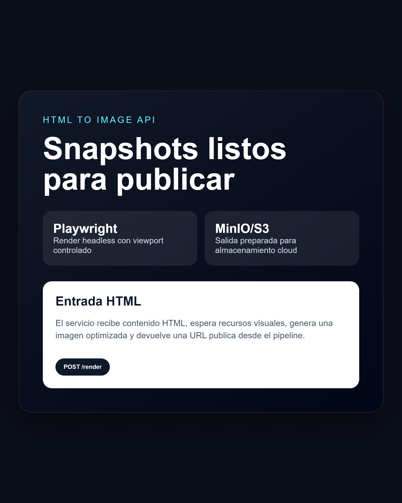

# htmltoimg

htmltoimg is a Flask microservice that receives HTML, renders it with Playwright/Chromium, optimizes the resulting image and returns a hosted image URL through an object storage pipeline.


Portfolio cover generated for presentation. Runtime screenshot:



## What it demonstrates

- API service for converting arbitrary HTML into image snapshots.
- Headless Chromium rendering with controlled viewport and resource loading.
- Image compression with Pillow.
- Object storage upload flow for generated assets.
- Health endpoint and structured JSON logging for operational visibility.

## Stack

- Python
- Flask
- Playwright
- Pillow
- MinIO/S3-compatible storage
- structlog

## Run locally

```bash
pip install -r requirements.txt
python -m playwright install chromium
python main.py
```

The service starts on port `3323` by default.

## API

Health check:

```bash
curl http://localhost:3323/health
```

Render HTML:

```bash
curl -X POST http://localhost:3323/render \
  -H "Content-Type: application/json" \
  -d "{\"html\":\"<html><body><h1>Hello</h1></body></html>\"}"
```

The response returns a JSON payload with the generated image URL.
